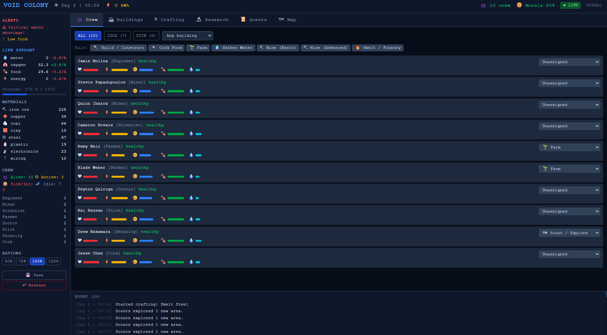

# VOID COLONY

Browser-based real-time colony management game built as a TypeScript monorepo.

The current implementation is a playable vertical slice: a Node/Express backend runs the simulation, persists a single save to SQLite, and broadcasts full game-state snapshots to a React frontend over WebSocket.



## Current Status

This repository is not a full implementation of the design document in [specs/VOID_COLONY_GDD.md](./specs/VOID_COLONY_GDD.md).

What is implemented today:
- Real-time tick loop running every 2 seconds
- Single active colony save persisted to SQLite
- REST actions for crew assignment, construction, research, crafting, scouting, rationing, saving, loading, and ship scavenging
- WebSocket state sync from backend to frontend
- Crew survival simulation for hunger, thirst, energy, morale, injury, sickness, and death
- Building, research, quest, event, crafting, and scouting subsystems
- Basic management UI with tabs for crew, buildings, crafting, research, quests, map, and event log

What is mostly data or planned scope right now:
- Large portions of the higher-tier building tree
- Many late-game technologies and victory-path systems
- Deeper map generation and deposit discovery
- Multiple saves, auth, multiplayer, and offline progression
- Automated tests and production deployment workflow

## Tech Stack

| Layer | Technology |
| --- | --- |
| Backend | Node.js, TypeScript, Express 5, `ws`, `better-sqlite3` |
| Frontend | React 19, Vite 7, TypeScript, Tailwind CSS 4 |
| Persistence | SQLite |
| Runtime model | Single in-memory game state plus periodic persistence |

## Repository Layout

```text
space-outpost/
├── backend/              # Simulation server, API, persistence
│   └── src/
│       ├── api/          # REST routes and WebSocket wiring
│       ├── config/       # Resources, buildings, techs, recipes, balance
│       ├── db/           # SQLite access
│       ├── engine/       # Tick-based simulation subsystems
│       ├── models/       # Game state types
│       ├── gameLoop.ts   # Main tick loop
│       └── server.ts     # Backend entry point
├── frontend/             # React client
│   └── src/
│       ├── components/   # Sidebar, main panels, event log, header
│       ├── hooks/        # WebSocket state + REST actions
│       ├── types/        # Frontend game state types
│       └── utils/        # Formatting helpers
├── specs/                # Design and product reference docs
└── package.json          # Root scripts for local development
```

## Architecture

### Backend flow

1. `backend/src/server.ts` initializes SQLite and loads save `id = 1`.
2. If no save exists, `createInitialState()` creates a new colony.
3. `startLoop()` runs the simulation every `TICK_INTERVAL_MS` milliseconds.
4. Each tick mutates the in-memory `GameState` through engine modules in order:
   - resources
   - crew
   - buildings
   - research
   - events
   - quests
   - crafting
   - scouting
5. Every 30 ticks, the backend saves state to SQLite.
6. After each tick, the backend broadcasts the full state snapshot to connected clients.

### Frontend flow

- `useGameState()` opens a WebSocket connection to `ws://<hostname>:3000`.
- `useActions()` sends REST `POST` requests to `/api/...`.
- `App.tsx` renders the latest server-owned snapshot and delegates user actions back to the backend.

This means the backend is the source of truth and the frontend is primarily a thin renderer plus action dispatcher.

## Implemented Gameplay Snapshot

### Starting state

- Approximately 10 to 14 crew members at game start
- Initial crash-site buildings including ship, quarters, warehouse, repair station, cooking station, and broken radio
- A 20x20 map with the colony placed at the center and nearby tiles pre-explored
- Starting stockpile of life-support and early construction resources

### Simulation rules

- `1 tick = 2 real seconds`
- `30 ticks = 1 game hour`
- `720 ticks = 1 game day`
- Day/night cycle affects solar generation
- Rationing affects both morale and survival
- Random events can injure crew, reduce morale, or damage buildings
- Research requires an operational research lab plus assigned researchers
- Construction requires assigned builders on the target building
- Crafting jobs consume resources immediately and deliver outputs when the timer completes

### Persistence model

- Saves are stored in SQLite as serialized JSON
- The current code uses a single active save slot by default
- The backend performs light save migration for some newly added fields

## Getting Started

### Prerequisites

- Node.js 18+
- npm 9+

### Install

```bash
npm install
npm install --prefix backend
npm install --prefix frontend
```

### Run in development

```bash
npm run dev
```

Services:
- Backend: `http://localhost:3000`
- Frontend: `http://localhost:5173`
- WebSocket: `ws://localhost:3000`

### Build

```bash
npm run build
```

### Run backend from build output

```bash
npm run start:backend
```

## Scripts

### Root

```bash
npm run dev
npm run build
npm run start:backend
npm run start:frontend
```

### Backend

```bash
npm run dev --prefix backend
npm run build --prefix backend
npm run start --prefix backend
```

### Frontend

```bash
npm run dev --prefix frontend
npm run build --prefix frontend
npm run lint --prefix frontend
```

## Notes And Limitations

- The backend keeps all live game logic in one mutable in-memory state object.
- API handlers mutate state directly instead of going through a dedicated command layer.
- WebSocket updates send the full state object each tick rather than patches.
- There is currently no automated test suite behind the shipped scripts.
- Some README claims from earlier drafts, including crew scale and full feature coverage, were ahead of the implementation and have been corrected here.

## Design Reference

The design intent lives in [specs/VOID_COLONY_GDD.md](./specs/VOID_COLONY_GDD.md). Treat that file as target scope, not as a statement of completed functionality.
